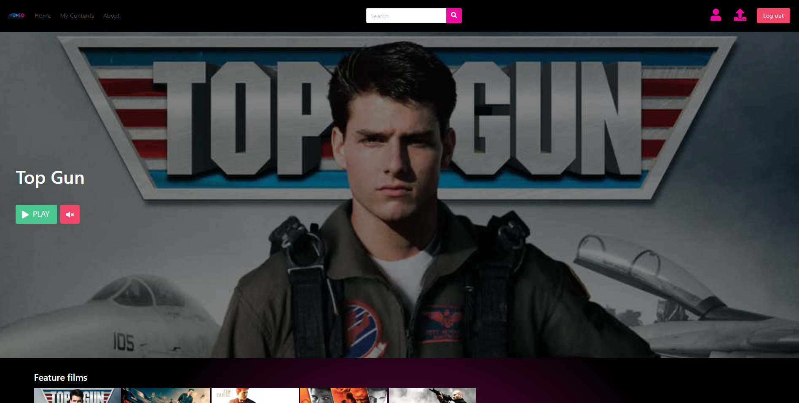
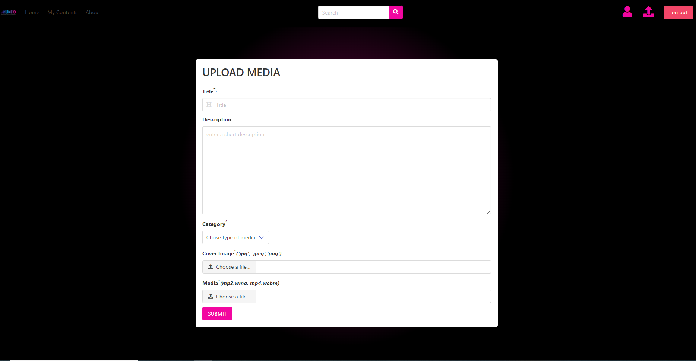

# <center>Mudeo</center>  <hr style="border:1px solid gray"> </hr>
## Share and watch your medias
### Features:  🎥 Movies, 🎵 Music

Mudeo is a web application that allow you to upload up to 5 files. Mudeo is made also for streaming.

Accepted formats for medias:

-***mp3, waw, webm, mp4***

Accepted formats for cover image:

-***jpeg, jpg, png***



Copy the project in your folder and install the database dump in your PhpMyAdmin. Follow the instructions to complete the installation.
⚠️If you are using a mac-OS or Linux replace the FFMPEG libraries from <a href="https://ffmpeg.org/download.html">here</a>
## Prerequisites

-Apache Server

-PHP 5.6+

-Mysql Database

-FFMPEG

-PHP MAILER

Install LARAGON for an easy quickstart

## Routing
The router app/libraries/core.php accept 3 parameters.
```
call_user_func_array([$this->currentController, $this->currentMethod], $this->params);
```


## Config 
Modify the app/config/config.php file according to your needs. You can use example.config.php file inside the same folder as an example based on my local settings.
```
//Database Configuration
define('DB_HOST', '<databaseHost>');
define('DB_USER', '<databaseUser>');
define('DB_PASS', '<databasePassword>');
define('DB_NAME', '<databaseName>');
```
Modify Like this
```
//Database Configuration
define('DB_HOST', 'localhost');
define('DB_USER', 'root');
define('DB_PASS', '');
define('DB_NAME', 'shareposts');
```


## Upload Media
The file that manage the uploading is under app/controllers/medias/add. When a cover image is add the file is resized to the correct Ratio.
Video size must be < 1gb. When the video is uploaded the FFMMPEG libraries first compress and resize the video to 1920x1080 px format. Video is renamed with a unique id and place into public/entities/videos and the link is added to bdd.entities.full_media.
You can change the output format size with FFMPEG for further information please reade the complete documentation on FFMPEG <a href="https://ffmpeg.org/documentation.html">Documentation</a>
```
$cmd="$ff -i $file_temp  -s 1920:1080  $final_directory";
```
When an Audio file is uploaded FFMPEG automatically create a mp4 video with audio wave. You can change the output format size, the wave color and format with FFMPEG for further information please read the complete documentation on FFMPEG <a href="https://ffmpeg.org/documentation.html">Documentation</a>
```
$filter="[0:a]showwaves=colors=blueviolet:s=1280x720:mode=cline,format=yuv420p[v]";
 $map="[v]";
 $cmd="$ff  -i $file_temp -filter_complex $filter -map $map -map 0:a -c:v libx264 -c:a copy $final_directory";
```


## License

